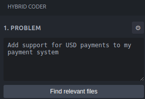
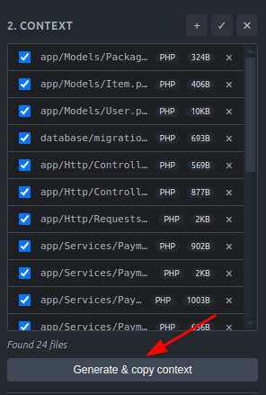
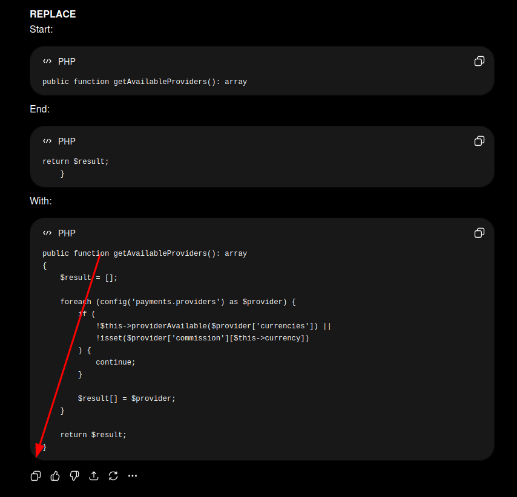
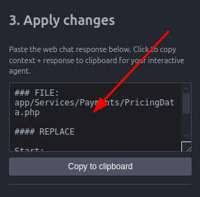
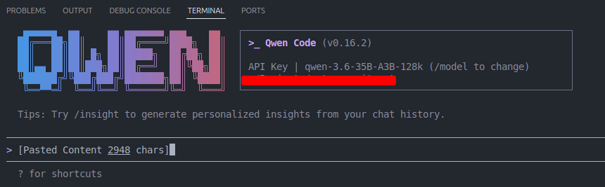

# Hybrid Coder

A VS Code extension that implements a **hybrid AI coding workflow**: a local CLI agent acts as the executor, while a web-based AI chat serves as the planner.

**Main goal:** Enable complex coding tasks on consumer hardware where you cannot run a top-tier agent, only a small, heavily-quantized local model. Instead of paying for Claude, Codex, or similar agents, you delegate the hard reasoning to free web chats, while the local CLI just reads files and applies patches.

For example, you can run a Qwen3.6-35B-A3B with Q4 quantization locally, but solve the task with a "brain" on the level of Gemini 3.1 Pro.

## Why Use This

The core idea is simple: **don't rely on local AI model to do everything**. Instead, split the work between two agents, each doing what it's best at:

- **Local CLI agent** (e.g. `qwen`, `codex`, `OpenCode`, `claude`) — runs on your machine, has direct access to your files. Use it for what it's good at: scanning the codebase to find relevant files, and applying code changes. It doesn't need to be smart — just reliable.
- **Web AI chat** (Claude, GPT, Gemini, Google AI Studio etc.) — the real "brain". Handles planning, architecture, and reasoning. Usually free, and significantly smarter than anything you can run locally on consumer hardware.

**Benefits:**

- **Better results** — leverage the best models available instead of being limited by your GPU.
- **Full control** — you curate which files go into context. No black-box agent guessing what's relevant.
- **No vendor lock-in** — swap out the web chat or the local CLI agent independently. No proprietary accounts or SDKs required.
- **Transparent** — every step is visible in the sidebar. You see exactly what files were found, what context was generated, and what plan was produced before anything is applied.

## How It Works

The extension orchestrates a **3-step pipeline** inside VS Code's sidebar:

### Step 1 - Problem

Describe what you want to build or fix in the prompt field.



### Step 2 - Context

1. Click **"Find relevant files"**. The extension spawns your configured local CLI agent (e.g. `qwen`) in non-interactive mode with a system prompt asking it to scan the codebase and return only relevant file paths.
2. The extension resolves those paths, checks which files exist and their sizes, and displays them in a file list.
3. You can **select/deselect** files, **add** files manually, or **remove** files.
4. Click **"Generate & copy context"**. The extension produces a Markdown document containing:
   - The problem description
   - Full content of all selected files (up to the configured size limit)
   - An output-format instruction for the CLI agent

This Markdown is copied to your clipboard, ready to be pasted into a web-based AI chat.



### Step 3 - Apply Changes

1. Paste the context into your web AI chat and get the implementation plan.



2. Copy the response and paste it into the "Apply changes" textarea in Hybrid Coder.



3. Click **"Copy to clipboard"**. The extension combines the `APPLY_CHANGES_SYSTEM` prompt, your web chat response, and the context Markdown into a single prompt, also copied to the clipboard.



4. Paste this combined prompt into your **interactive CLI agent** (e.g. `qwen -i`) to apply the actual code changes.


```
┌─────────────────────────────────────────────────┐
│  Hybrid Coder Workflow                           │
│                                                  │
│  1. You describe the problem                     │
│  2. Local CLI agent finds relevant files         │
│  3. You curate the file list                     │
│  4. Extension generates context Markdown ──►     │
│       Paste into web AI chat (the "brain")       │
│  5. Web AI returns an implementation plan        │
│  6. Extension combines plan + context ──►        │
│       Paste into interactive CLI agent (the      │
│       "executor") to apply changes               │
└─────────────────────────────────────────────────┘
```

## Requirements

| Requirement | Details |
|---|---|
| **VS Code** | Version 1.85.0 or later |
| **Local CLI AI agent** | Any CLI tool that accepts prompts via command-line arguments (e.g. `qwen`). Must be available in your system `PATH`. |
| **Workspace** | A VS Code workspace folder must be open |


## Example Configuration

You can configure any CLI tool that supports non-interactive mode. The extension will also work if you use paid cloud models, but its main purpose is to run tasks without cost. That usually means starting a local server that serves your chosen AI model, then configuring your CLI tool to use that local endpoint instead of a paid API key.

For example, with `qwen` you just create the configuration file at `~/.qwen/settings.json`. Many other tools work on the same principle, but you will need to check the documentation for the specific tool you want to use.
:

```json
{
  "security": {
    "auth": {
      "selectedType": "openai"
    }
  },
  "env": {
    "OLLAMA_API_KEY": "ollama"
  },
  "modelProviders": {
    "openai": [
      {
        "id": "qwen-3.6-35B-A3B-128k",
        "name": "Qwen3.6",
        "envKey": "OLLAMA_API_KEY",
        "baseUrl": "http://127.0.0.1:8910/v1",
        "generationConfig": {
          "timeout": 600000,
          "maxRetries": 1,
          "contextWindowSize": 128000,
          "samplingParams": {
            "temperature": 0.2,
            "top_p": 0.9,
            "max_tokens": 32768
          }
        }
      },
    ]
  },
  "$version": 4,
  "ide": {
    "enabled": true,
    "hasSeenNudge": true
  },
  "model": {
    "name": "qwen-3.6-35B-A3B-128k"
  },
}
```


